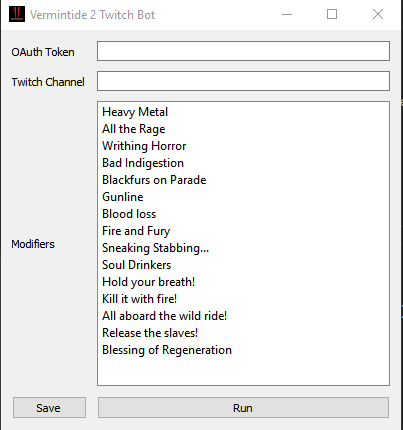

# Vermintide 2 Twitch Bot

Vermintide 2 Twitch Bot is a program that takes advantage of the Twitch API and Google Vision API to enable users without viewers to utilize Vermintide 2's Twitch Integration.



### How it works
The Vermintide 2 Twitch Bot uses [Streamlink][streamlink] to fetch frames from a designated stream every 5 seconds and saves them under the name of `frames.jpg`. The saved image is send to the Google Vision API for text recognition, and the resulting text strings are compared with the list of [Vermintide 2 modifiers][v2mods]. If a match between the results and the modifier list is found, the Twitch bot posts either "#A" or "#B" to the specified Twitch channel.

The list of modifiers are saved in `.twitch.cfg` under the `mod` key, sorted in decreasing order of preference.

### Installation
- Download Python v3.6+
- Setup a Google Cloud Platform Project and Authentication [here][gcp]
    - Follow the instructions listed under "If you have not created a Google Cloud Platform (GCP) project and service account credentials, do so now. Expand this section for instructions."
- Install the required packages
```txt
pip install -r requirements.txt
```

### How to run
- Run `python verminbot.py`

### Running the application
- Fetch an OAuth token from Twitch [here][oauth]
- Input the OAuth token into the `OAuth Token` field
    - Twitch's OAuth token is generated in the form 'oauth:`<oauth_token>`'
- Input the channel name of the streamer into the `Twitch Channel` field 
    - channel name = 'twitch.tv/`<channel name>`'
- Reorder the modifiers based on preference (descending order from top to bottom)

### TODO
- Create a GUI and a better way to exit the application.

[api]: <https://cloud.google.com/vision/docs/before-you-begin>
[gcp]: <https://cloud.google.com/vision/docs/ocr#text_detection_requests>
[oauth]: <https://twitchapps.com/tmi/>
[streamlink]: <https://streamlink.github.io/>
[v2mods]: <https://vermintide2.gamepedia.com/Twitch_Mode>
